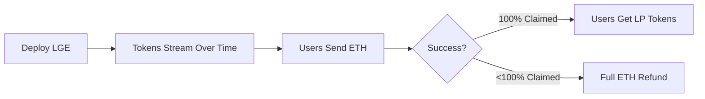

# Liquidity Generation Event (LGE) Uniswap 🦄 v4 Hook

A novel token launchpad mechanism built on Uniswap v4 using a hook for liquidity-first token creation.

## 🚀 Overview

The LGE Hook enables:
- Novel token launches focused on liquidity generation
- Dynamic price discovery through algorithmic tick placement  
- Full refund mechanism for unsuccessful launches

## 📊 How It Works



**Token Release**: 17.7B tokens stream linearly over 5,000 blocks (3.5M tokens/block)

**User Contribution**:
- 50% ETH → Pairs with tokens for LP (this is LP at half price essentially)
- 50% ETH → Commitment fee (retained on success). 

**Settlement**: Success triggers LP and rewards distribution, failure triggers full refund

### 🖼️ Mock up


*View of active LGE campaigns with dynamic pricing and one-click participation*

## 💡 Dynamic Pricing Model


### Implementation

```solidity
pragma solidity ^0.8.26;

import {TickMath} from "v4-core/libraries/TickMath.sol";
import {FullMath} from "v4-core/libraries/FullMath.sol";
import {FixedPoint96} from "v4-core/libraries/FixedPoint96.sol";

library LGECalculationsLibrary {
    uint256 constant TOTAL_SUPPLY = 17_745_440_000e18;
    uint256 constant LOW_THRESHOLD = 774_544_000e18; // ~4.4% of supply
    uint256 constant HIGH_THRESHOLD = 2_774_544_000e18; // ~15.6% of supply
    int256 constant TMAX = 887_272; // Maximum tick
    int256 constant TICK_SPREAD = 25_000; // +- range for liquidity

    function ticksForClaim(
        uint256 batchSize,
        int24 baseTick
    ) public pure returns (int24 tickLower, int24 tickUpper, int256 tick) {
        if (batchSize < LOW_THRESHOLD) {
            // Smooth curve: -TMAX to BASE_TICK
            int256 x = int256((batchSize * 1e18) / LOW_THRESHOLD);
            int256 oneMinusX = int256(1e18) - x;

            tick =
                ((-TMAX * oneMinusX * oneMinusX) / 1e36) +
                ((baseTick * x * x) / 1e36);
        } else if (
            (batchSize >= LOW_THRESHOLD) && (batchSize <= HIGH_THRESHOLD)
        ) {
            // Plateau around BASE_TICK
            int256 y = int256(
                ((batchSize - LOW_THRESHOLD) * 1e18) /
                    (HIGH_THRESHOLD - LOW_THRESHOLD)
            );

            tick = (baseTick * (9e17 + (y / 10))) / 1e18;
        } else {
            // Rising curve: BASE_TICK to TMAX
            int256 z = int256(
                ((batchSize - HIGH_THRESHOLD) * 1e18) /
                    (TOTAL_SUPPLY - HIGH_THRESHOLD)
            );

            tick = baseTick + ((TMAX - baseTick) * z * z) / 1e36;
        }

        // Snap to tick spacing and calculate bounds
        tick = (tick / 200) * 200;
        tickLower = int24(tick - TICK_SPREAD);
        tickUpper = int24(tick + TICK_SPREAD);

        require(
            tickLower >= -887272 && tickUpper <= 887272,
            "Ticks out of bounds"
        );
    }

    function getETHPriceFromRange(
        uint256 batchSize, // amount1 in wei
        int24 baseTick
    ) public pure returns (uint256 ethPrice) {
        (, , int256 tick) = ticksForClaim(batchSize, baseTick);

        // Calculate required ETH amount
        uint256 sqrtPriceEth = TickMath.getSqrtPriceAtTick(int24(tick));
        uint256 res = FullMath.mulDiv(
            sqrtPriceEth,
            sqrtPriceEth,
            FixedPoint96.Q96
        );
        ethPrice = FullMath.mulDiv(batchSize, FixedPoint96.Q96, res);
    }
}
```

### Configuration

```solidity
startingTick = 212_985;    // Parameterizable base tick
TICK_SPACING = 200;        // Uniswap V4 requirement  
TICK_SPREAD = 25_000;      // Liquidity spread range
```

## 🏛️ Architecture


## 📚 Resources

- [Uniswap v4 Hooks Documentation](https://docs.uniswap.org/contracts/v4/overview)
- [Tick Math Reference](https://docs.uniswap.org/contracts/v4/reference/core/libraries/TickMath)

## 📄 License

MIT

---

**Note**: Experimental protocol. Use at your own risk.
