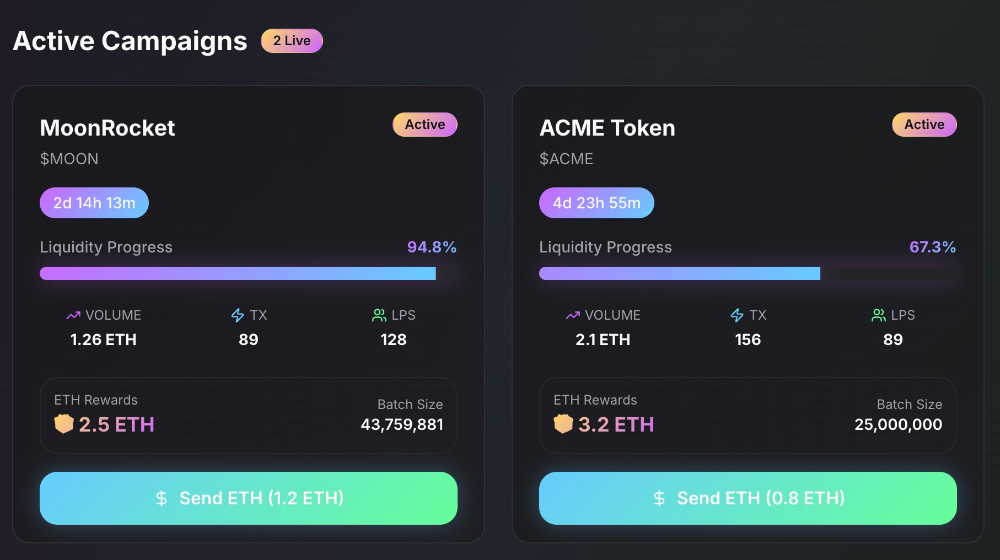
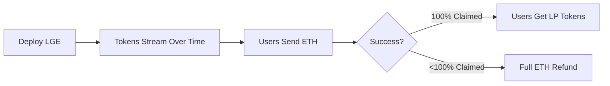

# Liquidity Generation Event (LGE) Uniswap 🦄 v4 Hook

A novel token launchpad mechanism built on Uniswap v4 using hooks for liquidity-first token creation.

## 🖼️ Live Platform



*Real-time view of active LGE campaigns with dynamic batch pricing and one-click participation*

## 🚀 Overview

The LGE Hook enables:
1. Novel token launches focused on liquidity generation
2. Dynamic price discovery through algorithmic tick placement
3. Full refund mechanism for unsuccessful launches

## 🏗️ Architecture


**Core Components:**
- **LGE Hook Contract**: Manages token distribution and liquidity generation
- **Token Streaming**: Linear release mechanism (3,549,088 tokens/block over 5,000 blocks)
- **Price Discovery**: Dynamic tick calculation based on claim size
- **Liquidity Manager**: Handles LP position creation through `IPoolManager`
- **Settlement Module**: Processes success/failure conditions and distributions

## 📊 Core Mechanics

### Token Release Schedule

| Parameter | Value |
|-----------|-------|
| **Total Supply** | 17,745,440,000 tokens |
| **Release Period** | 5,000 blocks |
| **Release Rate** | 3,549,088 tokens/block |
| **Trading Lock** | 6,000 blocks |

### How It Works



1. **Launch**: Deploy contract with fixed token supply
2. **Contribute**: Users send ETH to claim streaming tokens
   - 50% ETH → Pairs with tokens for LP
   - 50% ETH → Commitment fee (retained on success)
3. **Settlement**:
   - ✅ Success: Users receive LP tokens
   - ❌ Failure: Full ETH refund

## 💡 Dynamic Pricing Model


The system uses a three-phase bonding curve:

| Claim Size | Tick Range | ETH Cost |
|------------|------------|----------|
| Small (0-4.4%) | -887,272 to startingTick | High (expensive) |
| Medium (4.4-15.6%) | ~90-100% of startingTick | Balanced |
| Large (15.6-100%) | startingTick to 887,272 | Lower (cheaper) |

### User Flow

1. **Get Available Tokens**: UI retrieves current token supply from linear release
2. **Calculate Required ETH**: 
   - Determines tick range via `ticksForClaim()`
   - Calculates price: `price = 1.0001^tick`
   - Applies 2x multiplier for commitment fee
3. **Single Transaction**: User sends exact ETH amount to claim entire batch

## 🔧 Implementation

### Tick Calculation Library

```solidity
// SPDX-License-Identifier:
pragma solidity ^0.8.26;

library LGECalculationsLibrary {
    uint256 constant TOTAL_SUPPLY = 17_745_440_000e18;
    uint256 constant LOW_THRESHOLD = 774_544_000e18;     // ~4.4% of supply
    uint256 constant HIGH_THRESHOLD = 2_774_544_000e18;  // ~15.6% of supply
    int256 constant TMAX = 887_272;                      // Maximum tick
    int256 constant TICK_SPREAD = 25_000;                // ± range for liquidity
    
    function ticksForClaim(
        uint256 tokensClaimed,
        int256 startingTick
    ) public pure returns (int24 tickLower, int24 tickUpper) {
        int256 tick;
        
        if (tokensClaimed < LOW_THRESHOLD) {
            // Smooth curve: -TMAX to startingTick
            int256 x = int256((tokensClaimed * 1e6) / LOW_THRESHOLD);
            int256 oneMinusX = int256(1e6) - x;
            tick = ((-TMAX * oneMinusX * oneMinusX) / 1e12) +
                   ((startingTick * x * x) / 1e12);
        } 
        else if (tokensClaimed <= HIGH_THRESHOLD) {
            // Plateau around startingTick
            int256 y = int256(
                ((tokensClaimed - LOW_THRESHOLD) * 1e6) /
                (HIGH_THRESHOLD - LOW_THRESHOLD)
            );
            tick = (startingTick * (900_000 + (y / 10))) / 1_000_000;
        } 
        else {
            // Rising curve: startingTick to TMAX
            int256 z = int256(
                ((tokensClaimed - HIGH_THRESHOLD) * 1e6) /
                (TOTAL_SUPPLY - HIGH_THRESHOLD)
            );
            tick = startingTick + ((TMAX - startingTick) * z * z) / 1e12;
        }
        
        // Snap to tick spacing and calculate bounds
        tick = (tick / 200) * 200;
        tickLower = int24(tick - TICK_SPREAD);
        tickUpper = int24(tick + TICK_SPREAD);
    }
}
```

### Bonding Curve Formulas

**Early Stage (< 4.4%)**: `tick = -TMAX × (1-x)² + startingTick × x²`  
**Plateau (4.4-15.6%)**: `tick = startingTick × (0.9 + 0.1 × progress)`  
**Late Stage (> 15.6%)**: `tick = startingTick + (TMAX - startingTick) × z²`

The function returns `tickLower` and `tickUpper` directly, ready for `modifyLiquidity()` calls with automatic tick spacing alignment and ±25,000 spread applied.

## ⚙️ Technical Details

### Uniswap V4 Integration
- Direct liquidity provision via `modifyLiquidity()` 
- Tick spacing: 200 (V4 compatible)
- Liquidity range: ±25,000 ticks from median
- All calculations performed on-chain for trustlessness

### Key Features
✅ Linear token release prevents front-running  
✅ Expensive small batches discourage sniping  
✅ Atomic liquidity operations  
✅ Fair launch with refund protection  

## 🛠️ Configuration

```solidity
startingTick = 212_985;    // Parameterizable base tick
TICK_SPACING = 200;        // Uniswap V4 requirement  
TICK_SPREAD = 25_000;      // Liquidity spread range
```

## 📚 Resources

- [Uniswap v4 Hooks Documentation](https://docs.uniswap.org/contracts/v4/overview)
- [Tick Math Reference](https://docs.uniswap.org/contracts/v4/reference/core/libraries/TickMath)

## 📄 License

MIT

---

**Note**: This is an experimental protocol. Use at your own risk. Always conduct thorough testing before mainnet deployment.
