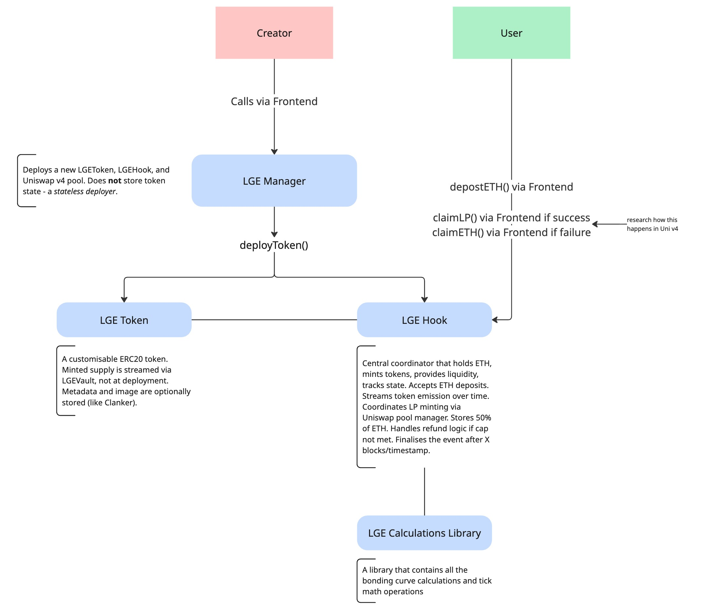
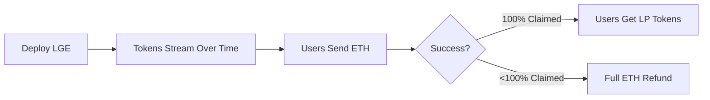
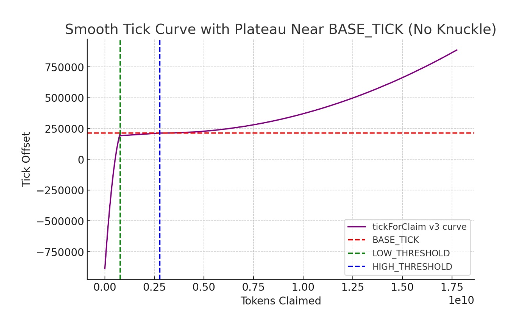

# Liquidity Generation Event (LGE) Uniswap 🦄 v4 Hook

A novel token launchpad mechanism built on Uniswap v4 using hooks for liquidity-first token creation. The system aims to leverage a v4 hook to inject custom logic at key points in the liquidity lifecycle, enabling a novel and experimental token launch.

## 🚀 Overview

The LGE Hook enables:
1. A novel token launches mechanism focused on liquidity
2. Price discovery through dynamic tick placement
3. Unsuccessful launches offer a full refund

## 🏗️ Architecture



The LGE Hook architecture:

- **LGE Hook Contract**: Manages token distribution and liquidity generation
- **Token Streaming**: Linear release mechanism that distributes tokens over 5,000 blocks
- **Price Discovery**: Dynamic tick calculation mapping claim sizes to optimal price points (upper and lower tick are then used to distribute liquidity)
- **Liquidity Manager**: Handles the creation and distribution of LP positions through `IPoolManager`
- **Settlement Module**: Manages success/failure conditions and processes refunds or LP token and rewards distribution
- **User Interface**: Tracks real-time token availability and calculates required ETH contributions

## 📊 Core Mechanics

### Token Release Schedule

| Parameter | Value |
|-----------|-------|
| **Total Supply** | 17,745,440,000 tokens |
| **Release Period** | 5,000 blocks |
| **Release Rate** | 3,549,088 tokens/block |
| **Trading Lock** | 6,000 blocks |

### How It Works



1. **Launch** - Deploy contract with fixed token supply
2. **Contribute** - Users send ETH to claim streaming tokens
   - 50% ETH → Pairs with tokens for LP
   - 50% ETH → Commitment fee (retained on success)
3. **Settlement**
   - ✅ Success: Users receive LP tokens. ETH "commitment" used for rewards, creators and LGE fees.
   - ❌ Failure: Full ETH refund

## 💡 Dynamic Pricing Model

The system uses an algorithm to map claim size to Uniswap tick placement:



| Claim Size | Tick Range | ETH Cost |
|------------|------------|----------|
| Small (0-4.4%) | Steep rise from -887,272 to 212,985 | High (expensive) |
| Medium (4.4-15.6%) | Plateau | Balanced |
| Large (15.6-100%) | Gradual rise to 887,272 | Lower (cheaper) |

## 🔧 Implementation

### Tick Calculation

```solidity
function tickForClaim(uint256 tokensClaimed) public pure returns (int256 Tick) {
    // Constants
    uint256 TOTAL_SUPPLY = 17_745_440_000;
    uint256 LOW_THRESHOLD = 774_544_000;      // ~4.4% of supply
    uint256 HIGH_THRESHOLD = 2_774_544_000;   // ~15.6% of supply
    int256 TMAX = 887_272;                    // Maximum tick
    int256 BASE_TICK = 212_985;               // Base tick (parameterizable)

    if (tokensClaimed < LOW_THRESHOLD) {
        // Smooth curve: -TMAX to BASE_TICK
        int256 x = int256(tokensClaimed * 1e6 / LOW_THRESHOLD);
        int256 oneMinusX = int256(1e6) - x;
        
        Tick = (-TMAX * oneMinusX * oneMinusX / 1e12)
             + (BASE_TICK * x * x / 1e12);
    } 
    else if (tokensClaimed <= HIGH_THRESHOLD) {
        // Plateau around BASE_TICK
        int256 y = int256((tokensClaimed - LOW_THRESHOLD) * 1e6 / 
                         (HIGH_THRESHOLD - LOW_THRESHOLD));
        
        Tick = BASE_TICK * (900_000 + (y / 10)) / 1_000_000;
    } 
    else {
        // Rising curve: BASE_TICK to TMAX
        int256 z = int256((tokensClaimed - HIGH_THRESHOLD) * 1e6 / 
                         (TOTAL_SUPPLY - HIGH_THRESHOLD));
        
        Tick = BASE_TICK + (TMAX - BASE_TICK) * z * z / 1e12;
    }

    // Snap to tick spacing
    Tick = (Tick / 200) * 200;
}
```

### ETH Requirement Calculation

```solidity
// 1. Get tick from bonding curve based on tokens claimed
tick = tickForClaim(tokensClaimed)

// 2. Calculate base ETH requirement
price = 1.0001^tick
ethRequired = tokensClaimed / price

// 3. Apply 2x multiplier (prevents LP discount)
userMustSend = ethRequired * 2
```

## ⚙️ Technical Details

### Uniswap Integration
- Uses `IPoolManager.mint()` for liquidity creation
- Implements `ModifyLiquidityParams` with ±25,000 tick range (Upper tick - Lower tick) so that liquidity is distributed
- Tick spacing: 200 (Uniswap v4 compatible)

### Key Features
- ✅ Linear token release over blocks
- ✅ Gamified LP creation with price discovery
- ✅ Refund mechanism for failed launches
- ✅ No front-running (fixed release schedule) and prohibitively expensive to buy small batches
- ✅ Fair launch

## 🛠️ Configuration

```solidity
// Parameterizable values
BASE_TICK = 212_985;  // Can be derived from target market cap
TICK_SPACING = 200;   // Uniswap v4 requirement
LIQUIDITY_RANGE = 25_000;  // ± from median tick derived via Tick Calculation
```

## 📚 Resources

- [Uniswap v4 Hooks Documentation](https://docs.uniswap.org/contracts/v4/overview)
- [Tick Math Reference](https://docs.uniswap.org/contracts/v4/reference/core/libraries/TickMath)
- Similar projects: Clanker

## 🤝 Contributing

Contributions are welcome! Please feel free to submit a Pull Request.

## 📄 License

MIT

---

**Note**: This is an experimental protocol. Use at your own risk. Always conduct thorough testing before mainnet deployment.
